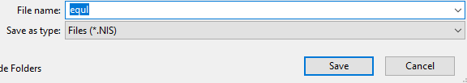

# Equitable GUI Automation

## Purpose

The program reads multiple test case information and automatically enters them in Novinsoft UL Illustrator
and saves the outputs in both `.NIS` and `.xls` format in the output folder respectively

**The following fields will be inputted:**

- UL Face Amount
- Gender
- Age
- Smoking Status
- Monthly Deposit
- Deposit To Age
- Term Face Amount
- Term To Age

> If you need to add any element to the list above, \
> please edit the code of `mapping.py`

## Download and Setup Software

- [Python](https://www.python.org/downloads/)\
Installing by default setting is fine.\
“IDLE (Python 3.10 64-bit)” will be installed automatically together with Python.
- [Pycharm](https://www.jetbrains.com/pycharm/download/#section=windows)\
Download Community version.\
Click “No” when it requires an admin login.\
Use the default installation path and check ✓ to all the boxes after that.
- After installing Pycharm, Execute it and click on “Python Packages”  in the left bottom corner.
  
- Search the following packages and click install on the right for each of them:
  * Pillow
  * openpyxl
  * pandas
  * numpy
  * PyAutoGUI
  * opencv-python
  
- Open autoEqul-master folder in Pycharm:\
  File -> Open -> folder location you chose -> click on autoEqul-master -> OK

> Now we are done with setting up
> 
## Before launching the program (1):
- Open Novinsoft – UL Illustrator. \
  If you already had it opened and made any changes to it, please close it and reopen it. 
- Change default setting:
  * Enter “Applicant_1” or anything at the field “Owner” to ensure no windows pop up when a juvenile case is entered.
  * Click “Deposits/Tax Handling” tab and modify your illustrator like this picture:
  
  >*Note that this program does not make change to illustration interest rate.\
   You need to manually change it before running. i.e., if you need an illustrator interest rate of 4%, replace the 6.000 with 4.
- Click “Save” or ctrl+S to save the file as "equl" in folder\
  R:\SALESAPP\Explainer Tool\UL\Excel Tool\Testing\Zoe\Python tool\Test Cases NIS\

- Click “Spreadsheet” and click “Export to Excel”. On the window that pops up, select “Do not show this again” and click “Yes”.\
  Close the excel file. Close the spreadsheet. This will prevent pop-up windows from interrupting the program.

## Before launching the program (2):
- Open “config.py” with Pycharm
  * Edit INPUT_FILE = r"R:\SALESAPP\Explainer Tool\UL\Excel Tool\Testing\Zoe\Test Cases V58.xlsx" \
    to your input file path (the file with all the cases you need to run) 
  * Edit SAVED_NIS = r”\\eusers.equitable.int\desktops$\zzhu\Documents\equl.NIS” : replace zzhu with your username.
  * Edit EXPORTED_EXCEL = r"C:\Users\zzhu\AppData\Local\Temp\equl.xls": replace zzhu with your username.

## Notes before you run:
- Close all excel windows before you run the program, including the input file.
- Do not block your Novinsoft illustrator window with any window, make sure you can see it on your screen completely. 
  \Then, click on the “Coverage” tab.
- Do not move your cursor or press anything on your keyboard after you enter start case # and end case # in prompt!
- It takes around 60 sec to run one case. Please be prepared for the wait time if you are running a lot of cases.

## Running the program:
- Right click on “main.py”, then click on “Run ‘main’”.

- when you see the prompt “Start from test case #”, enter the case # you want to start with, \
then enter the case # you want to end with.
- If a case runs successfully, you will see “Auto completing Test Case {i}”
- You can always break a run by clicking the red stop bottom.
>Note: the program may not work if the format of the input file changes.
> 
> 
## After Running the Program:
- You can find the cases saved in NIS format and the Excel spreadsheet here: \
......(where you saved the program)\autoEqul-master\generated
